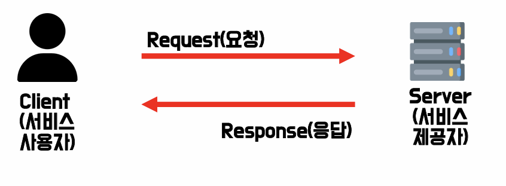
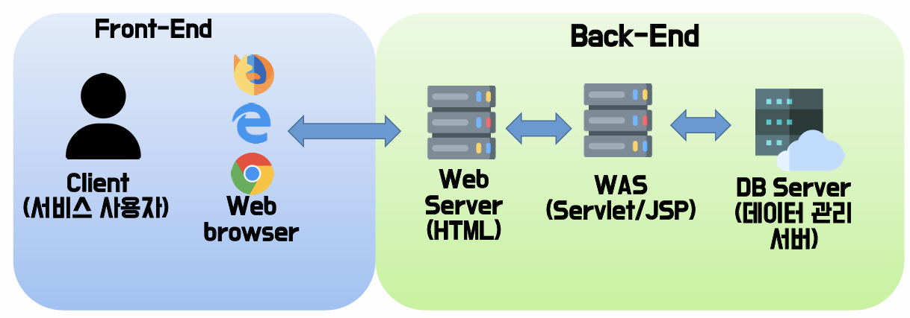
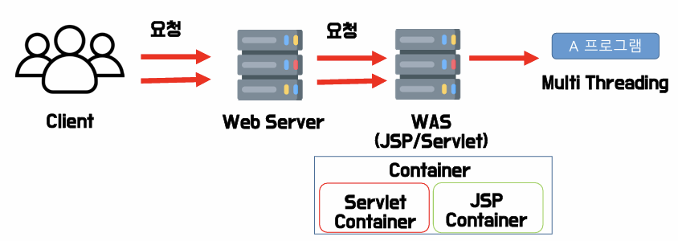
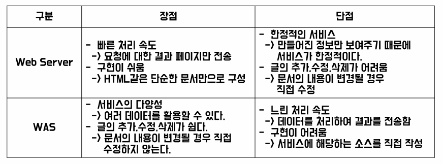

# 2024.06.04 - TIL

<br>

# 1. Server🛜

<br>
[ 출처 : team.ohgiraffers ]<br>
**< Server-client Model >**<br>
- Server : 특정한 서비스를 제공하는 컴퓨터
- Client : 서비스를 이용하는 사용자

<br>

### 1-1. Server의 종류
1. Web Server : 웹 브라우저와 HTTP 프로토콜을 사용하여 사용자의 요구에 따른 특정 서비스를 제공
<br>

2. Mail Server : 전자 우편을 주고 받는 서비스 제공
<br>

3. FTP Server : 파일을 업로드, 다운로드 할 수 있는 파일 관리 기능 제공
<br>

4. Talnet Server : Terminal, 텍스트로만 이루어진 창에서 특정 명령어를 통해 원격지 서버를 접속, 관리하는 서비스 제공
<br>

5. Database Server : Data를 저장하고 원격지에 접속한 경우 권한에 따라 데이터를 열람, 추가, 수정, 삭제 기능을 <br>처리하는 서비스 제공
<br>

### 1-2. Web 통신구조

<br>
[ 출처 : team.ohgiraffers ]<br>
<br>

# 2. Web Server란? 

- HTML 페이지나 jpg,png와 같은 이미지를 HTTP프로토콜을 통해 웹 브라우저에 제공하는 
서버로, <br>내부의 내용이 이미 만들어져 있는 정적인 요소들을 화면에 보여주는 역할
### 2-1. Web Server 종류

1. Apache
2. Microsoft LLS
3. NGINX

<br>

# 3. CGI와 WAS

### 3-1. CGI (Common Gateway Interface)

<br>
[ 출처 : team.ohgiraffers ]<br>

  **CGI** <br>
- 웹 서버가 직접적으로 웹 프로그램을 실행하는 것. 동일한 프로그램에 대한 요청이 있을 때마다 <br>각각 프로그램을 실행한다. 요청과 프로그램이 1:1 매칭되어 실행.<br>
- Perl이나 C/C++ 언어를 사용하여 웹서버가 실행할 수 잇는 프로그램 작성

<br>

### 3-2. WAS (Web Application Server)

[ 출처 : team.ohgiraffers ]<br>

**WAS (Web Application Server)**
- 사용자가 요청한 서비스의 결과를 스크립트 언어 등으로 가공하여 
생성한 동적인 페이지를 사용자에게 보여주는 역할<br><br>
- 웹 서버가 웹 어플리케이션 서버에 요청하면 웹 어플리케이션 서버가 해당되는 프로그램을 실행하는 방식<br><br>
  한 프로그램에 여러 요청이 있는 경우 한 개의 프로그램을 실행하여 그 프로그램을 다수 요청을 처리

**WAS 종류**
1. tomcat
2. wildFly
3. jeus

### 3-3. 둘의 차이점

[ 출처 : team.ohgiraffers ]<br>
<br>

# 4. Servlet🍟

### 4-1. Servlet이란?
- Server + Applet의 합성어, JAVA 언어를 이용하여 사용자의 요청을 받아 처리하고<br> 그 결과를 다시 사용자에게 전송하는 역할의 Class 파일을 말한다. 
<br>

- 즉 웹에서 동적인 페이지를 java로 구현한 서버측 프로그램

### 4-2. Servlet 설계 규약 
1. 모든 Servlet은 `javax.servlet.Servlet` 인터페이스를 상속 받아 구현한다.
<br>

2. Servlet은 구현시 Servlet 인터페이스와 ServletConfig 인터페이스를 <br>
`javax.servlet.GenericServlet`에 구현한다.
<br>

3. HTTP 프로토콜을 사용하는 Servlet은 `javax.servlet.http.HttpServlet` 클래스는 <br>
   `javax.servlet.GenericServlet` 를 상속한 클래스로 Servlet은 httpServlet 클래스는 상속받는다.
<br>

4. Servlet의 Exception을 처리하기 위해서는 `javax.servlet.ServletException`을 상속 받아야 한다. 

### 4-3. Servlet 동작 구조

<br>

[ 출처 : team.ohgiraffers ]<br>

---


1. 사용자가 URL을 통해 요청을 보내면 HTTP Request를 Servlet Container로 전송
<br>

2. HTTP Request를 전송받은 Serlvet Container는 HttpServletRequest, HttpServletResponse 두 객체를 생성
<br>

3. 요청한 URL을 분석하여 어느 서블릿에 대해 요청을 한 것인지 찾기
<br>

4. 해당 서블릿에서 service 메소드를 호출한 후 POST, GET여부에 따라 doGet() 또는 doPost()를 호출
<br>

5. doGet(), doPost() 메소드는 동적 페이지를 생성한 후 HttpServletResponse 객체에 응답을 보냄
<br>

6. 응답이 끝나면 두 객체를 삭제


<br>
   
- Servlet Conatiner
<pre>
[ Servlet Container ]

> 웹 서버 또는 응용 프로그램 서버의 일부로, 웹 서버에서 온 요청을 받아 servlet class 를
  관리하는 역할(생명주기)을 한다. 즉, Java servlet을 실행하는 환경을 제공하는 컴포넌트라고 
  할 수 있다.

Servlet 의 기능
> 1. Servlet의 생명 주기 관리 : 서블릿의 생성, 초기화, 요청 처리, 종료 등을 관리, servlet의 
                              라이프 사이클 메서드 (init, service, destroy)를 호출해서 처리
  
  1. 요청과 응답 관리 : HTTP 요청을 받아서 해당 요청에 맞는 Servlet으로 전달하고, Servlet이 생성한
                      HTTP 응답을 Client로 다시 전달

  2. 스레드 관리 : 여러 클라이언트 요청을 동시에 처리하기 위해 스레드를 생성하고 관리. 각 요청은 
                  별도의 스레드에서 처리되기 때문에 동시성을 효율적으로 관리

  3. 웹 어플리케이션 배포 : web.xml 파일을 읽고, 애플리케이션에 정의된 서블릿, 필터, 리스너 등의 
                        설정을 로드함. 이 파일을 통해 서블릿 매핑, 초기화 매개변수 등을 설정할
                       수 있음

  4. 보안 관리 : 사용자 인증 및 권한 부여를 처리. 서블릿 컨테이너는 web.xml 파일에 정의된 보안 제약 
                사항에 따라 클라이언트의 접근을 제어

  5. 세션 관리 : HTTP 세션을 생성하고 관리해서 세션을 통해 클라이언트와의 상태 정보를 유지
</pre>

<pre>
[ JSP Container ]

> JSP파일을 다시 java코드로 변경해주고 class파일로 전환하여 메모리 공간에 로드한 뒤 실행 가능하게 
  만드는 작업을 진행(Servlet화), 처리결과를 HTML파일로 만들어주는 작업진행, 동적로딩처리 
</pre>

### 4-4. `Servlet` 의 Life-Cycle
1. 첫 번째 요청일 경우, 객체를 생성하며 init() 메소드 호출
<br>

2. 이 후 작업이 실행 될때마다 service() 메소드가 요청한 HTTP Type에 따른 doGet(), doPost() 메소드 호출
<br>

3. 최종적으로 Servlet이 서비스 되지 않을 때 destroy() 메소드가 호출
   
- destroy()는 보통 서버가 종료되었을 때, Servlet의 내용이 변경되어 재 컴파일 될 때 호출함.
<br><br>

- Servlet 생명주기 Java Code (Annotation 방식)
1. `index.jsp` : html 파일
```html
<%@ page contentType="text/html; charset=UTF-8" pageEncoding="UTF-8" %>
<!DOCTYPE html>
<html>
<head>
  <title>JSP - Hello World</title>
</head>
<body>
  <h1>라이프사이클 테스트</h1>
  <a href="xml-lifecycle">라이프사이클 테스트(xml)</a>
  <a href="annotation-lifecycle">라이프사이클 테스트(annotation)</a>
</body>
</html>
```
2. `LifeCycleTestServlet` : Servlet 클래스
```javascript
import jakarta.servlet.ServletConfig;
import jakarta.servlet.ServletException;
import jakarta.servlet.ServletRequest;
import jakarta.servlet.ServletResponse;
import jakarta.servlet.annotation.WebServlet;
import jakarta.servlet.http.HttpServlet;
import jakarta.servlet.http.HttpServletRequest;
import jakarta.servlet.http.HttpServletResponse;

import java.io.IOException;

@WebServlet(value="/annotation-lifecycle")
public class LifeCycleTestServlet extends HttpServlet {

    /* 각 메소드의 호출 횟수를 카운트할 목적의 필드 */
    private int initCount = 1;
    private int serviceCount = 1;
    private int destoryCount = 1;

    // 기본생성자
    public LifeCycleTestServlet() {
    }

    // 최초 서블릿 요청 시에 동작하는 메소드
    @Override
    public void init(ServletConfig config) throws ServletException {
        System.out.println("annotation 매핑 init() 메소드 호출" + initCount++);
    }

    // 서블릿 컨테이너가 종료될 때 호출되는 메소드이며 주로 자원을 반납하는 용도로 사용한다.
    @Override
    public void destroy() {
        System.out.println("annotation 매핑 destory() 메소드 호출 : " + destoryCount++);
    }

    @Override
    public void service(ServletRequest request, ServletResponse response) throws ServletException, IOException {
        /*
        * 서블릿 컨테이너에 의해 호출되며 최초 요청 시에는 init() 이후에 동작하고,
        * 두 번째 요청부터는 init() 호출 없이 바로 service()를 호출한다.
        * */
        System.out.println("annotation 매핑 service() 메소드 호출 : " + serviceCount++);
    }

    @Override
    protected void doGet(HttpServletRequest request, HttpServletResponse response) throws ServletException, IOException {

    }

    @Override
    protected void doPost(HttpServletRequest request, HttpServletResponse response) throws ServletException, IOException {

    }
}
```


