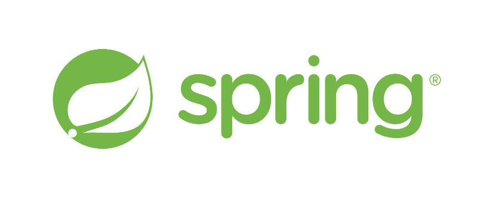
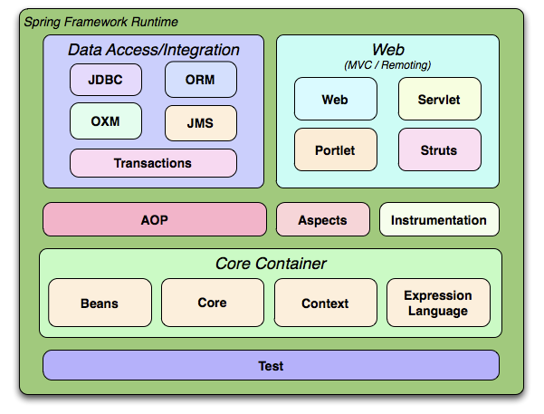

# 2024.06.11 - TIL : Spring Framework
 

# 1. Spring Framework란?

 

- JAVA 기술들을 더 쉽게 사용할 수 있게 해주는 오픈소스 프레임 워크
 

# 2. Spring의 특징

### 2-1. DI (Dependency Injection / 의존성 주입)
- 프로그래밍에서 구성요소 간의 의존 관계가 소스코드 내부가 아닌 외부의 설정파일을 통해 정의 되는 방식. 
  
- 객체들이 서로 직접 의존하지 않기 때문에 결합도가 낮아지고 의존성 관리가 중앙화되어서 이는 코드 변경시에 영향을 최소화할 수 있다. 

1. 생성자 주입 
2. 필드 주입
3. Setter 주입
 
(추후에 다시 다루기..)
  
### 2-2. IoC (Inversion of Control / 제어의 역전)
- 객체의 생성과 제어를 개발자가 아닌 외부에서 관리하도록 하는 개념. 

- 기존에는 객체가 자신이 사용할 다른 객체를 직접 생성하고 관리하지만, IoC에서는 이러한 제어권을 프레임워크나 컨테이너에게 위임한다. 즉 객체의 생성과 생명주기를 프레임워크가 담당하게 된다.  
  
- spring에서는 IoC Container가 이를 관리하게 된다.  
  
### 2-3. AOP (Aspect-Oriented Programming / 관점 지향 프로그래밍) 

- 로깅, 트랜잭션, 보안 등 여러 모듈에서 공통적으로 사용하는 기능을 분리하여 관리 가능하다.  

- 여러 객체에 공통으로 적용할 수 있는 기능을 구분함으로써 재사용성을 높여주는 기법  

### 2-4. POJO (Plain Old Java Object)
- getter/setter를 가진 단순한 자바 Object

 

# 3. Spring의 구성 모듈

 
출처 : 
https://docs.spring.io/spring-framework/docs/3.2.x/spring-framework-reference/html/overview.html
 

### 3-1. Core Container

코어, 빈, 컨텍스트, 표현 언어 모듈로 구성되어 있다.

**1. Core**
- Spring의 핵심 모듈로, IoC와 DI를 제공해준다. 
- BeanFactory와 ApplicationContext 인터페이스를 사용한다.

**2. Beans**
- IoC 컨테이너의 Bean 생성, 설정, 관리 기능을 담당한다.

**3. Context**
- 애플리케이션을 구성하는 환경을 제공하며, 메시지 리소스 처리, 이벤트 발행, 애플리케이션 계층 간 통합 등을 지원한다.

**4. Expression Language**
- 런타임 시점에 객체 그래프를 쿼리하고 조작할 수 있는 강력한 표현식 언어
 

### 3-2. AOP (Aspect-Oriented Programming)
로깅, 트랜잭션 관리 등의 부가 기능을 핵심 비즈니스 로직에서 분리한다.
 

### 3-3. Data Access/Integration
데이터베이스와의 통합, ORM 지원, 메시징 시스템과으 통합 등을 담당한다. 
즉 데이터베이스를 사용하기 편하게 해준다고 할 수 있다.

- 종류
1. JDBC : JDBC를 사용한 데이터 접근을 단순화하고, 리소스 관리를 자동으로 처리 
   
2. ORM : Object Relational Mapping, ORM 프레임워크와의 통합을 지원  
   
3. OXM : Object/XML Mapping, Object와 xml 매핑 지원  
   
4. JMS : Java Message Service를 사용한 메시징 지원  
   
5. Transaction
 

### 3-4. Web
MVC 패턴을 기반으로 한 웹 애플리케이션 개발을 지원해준다. (RESTful 서비스 개발, 웹소켓 등을 포함)

---

[참고 자료]  
https://jerryjerryjerry.tistory.com/62  

