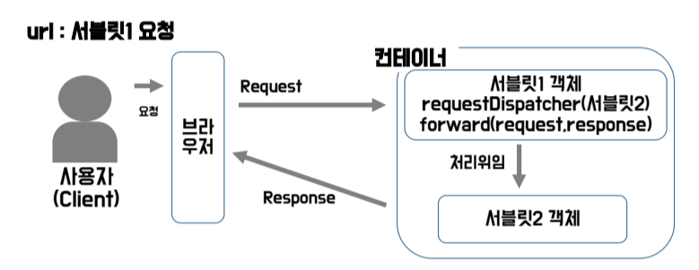
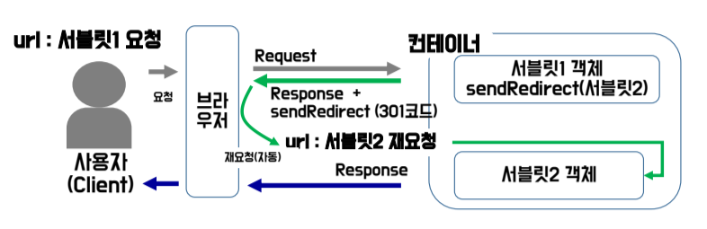

# 2024.06.05 - TIL
<br>

# 1. Servlet의 Forward & Redirect

### 1-1. Forward 메소드
<br>


<br>
[ 출처 : team.ohgiraffers ]<br>


- 컨테이너 내에서 처음 요청 받은 페이지가 요청 데이터 (HttpServletRequest, HttpServletResponse)를 다른 페이지에 전송하여 처리를 요청을 하고 자신이 처리한 것처럼 하는 것.<br> 
- 즉, 클라이언트의 요청을 동일한 서버 내의 다른 Servlet, JSP 등으로 전달하는 메소드<br>
  
- **특징**
1. 웹 컨테이너 내부에서 동작. `request의 정보가 유지`되어 사용할 수 있다.
2. 처음 요청 URL이 변경되지 않는다.
3. Redirect보다 `속도` 면에서 빠르다. <br>

### 1-2. Forward 메소드 예제 코드

index.jsp
- 값 입력할 html 파일

```html
<%@ page contentType="text/html; charset=UTF-8" pageEncoding="UTF-8" %>
<!DOCTYPE html>
<html>
<head>
    <title>JSP - Hello World</title>
</head>

<body>
    <h1>forward</h1>
    <form action="forward" method="post">
        <table>
            <tr>
                <td>아이디 : </td>
                <td><input type="text" name="userId"></td>
                <td rowspan="2"><button type="submit" style="height:50px;">로그인</button></td>
            </tr>
            <tr>
                <td>비밀번호 : </td>
                <td><input type="password" name="password"></td>
            </tr>
        </table>
    </form>
</body>
</html>
```

<br>

첫번째 Servlet
- 위에서 입력한 아이디와 비밀번호를 다른 Servlet에 넘겨주기 위해 `forward` 메소드를 사용했다.
- `forward`로 값을 넘겨주려면 `setAttribute`를 이용해서 request에 값을 저장하고, `RequestDispatcher`로 넘겨줘야 한다.
<br><br>
  
```java
import jakarta.servlet.*;
import jakarta.servlet.annotation.WebServlet;
import jakarta.servlet.http.*;

import java.io.IOException;

@WebServlet("/forward")
public class ReceiveInformationServlet extends HttpServlet {

    @Override
    protected void doPost(HttpServletRequest request, HttpServletResponse response) throws ServletException, IOException {

        // 아이디랑 비밀번호를 가져오고 싶다. 그렇다면 tag의 name을 알아야 한다.

        String userId = request.getParameter("userId");
        String password = request.getParameter("password");

        System.out.println("userId = " + userId);
        System.out.println("password = " + password);

        // forward는 request에서 값을 뽑아 사용한다. forward 방식은 attribute 형태로 값을 전달해 준다.
        request.setAttribute("userId", userId);
//        request.setAttribute("userName", userName);
        RequestDispatcher dispatcher = request.getRequestDispatcher("print"); // print 주소로 보내기
        dispatcher.forward(request, response);
    }
}
```
<br>

`forward` 받은 Servlet
- forward 받은 데이터를 사용해서 새로운 html 페이지를 만들어서 제공해준다.
<br><br>

```java
package com.ohgiraffers;

import jakarta.servlet.*;
import jakarta.servlet.annotation.WebServlet;
import jakarta.servlet.http.*;

import java.io.IOException;
import java.io.PrintWriter;

@WebServlet("/print")
public class PrintLoginSuccessServlet extends HttpServlet {

    /**
     * forward로 받은 서블릿에서도 요청 방식이 get이면 doGet메소드를, 요청방식이 post이면 doPost메소드를 호출한다.
     * 보내준 서블릿에서 request에 전달정보를 담았으므로 해당 서블릿에서 사용하기 위해 다시 request에서 꺼내온다.
     *
     * forward할 때 전달한 request와 response (앞 쪽 Servlet)의 모든 정보를 이용해 새로운 request, response를 만들고
     * 그 정보를 이용해 다시 http 메소드에 맞는 서블릿의 doGet 혹은 doPost를 요청하는 방식이다.
     * 깊은 복사를 이용해 값을 그대로 복사했기 때문에 내부에 존재하는 헤더 정보나 인스턴스는 그대로 유지하고 있다.
     */

    @Override
    protected void doPost(HttpServletRequest request, HttpServletResponse response) throws ServletException, IOException {

        String userId = request.getParameter("userId");
        System.out.println("userId getParameter >> " + userId);

        String userId2 = (String) request.getAttribute("userId");
        System.out.println("userId2 getAttribute >> " + userId2);

        StringBuilder responseText = new StringBuilder();
        responseText.append("<!doctype html>\n")
                .append("<html>\n")
                .append("<head>\n")
                .append("</head>\n")
                .append("<body>\n")
                .append("<h3 align=\"center\">")
                .append(userId)
                .append("님 환영합니다.</h3>")
                .append("</body>\n")
                .append("</html>\n");

        response.setContentType("text/html; charset=UTF-8");

        PrintWriter out = response.getWriter();

        out.print(responseText.toString());
        out.flush();
        out.close();
    }
}

/*
기본적으로 변수의 기본 스코프는 메소드(= 해당 페이지)이기 때문에 다른 페이지(= 서블릿)로 데이터를 공유할 수 없다.
하지만 forward방식은 request와 response를 포함햐여 위임하므로 request에 정보를 저장하여 forward하면
위임받은 서블릿에서도 위임한 서블릿의 정보를 공유할 수 있다.
forward 받은 서블릿의 존재를 클라이언트가 알 필요가 없기 때문에 url자체는 변경되지 않는다. (사용자는 결과 화면만 제대로 받으면 되기 때문이다.)
forward 방식의 또 다른 특징은 요청 시 서버로 전송한 데이터가 남아있는 상태로 새로고침(= 재요청)을 하면
동일한 요청을 반복하여 데이터베이스에 insert하는 등의 행위를 하면 중복된 행이 삽입될 가능성이 있다.
 */
```
---
### 1-3. Redirect 메소드
<br>


<br>
[ 출처 : team.ohgiraffers ]<br>

- 클라이언트에게 새로운 URL로 이동할 것을 요청하는 메소드, 클라이언트는 새로운 URL로 다시 요청을 보내게 됨<br>
  
- 특징
1. 브라우저의 URL이 변경된다. 클라이언트는 이동을 인식할 수 있게 된다.
2. 2번의 request/response가 발생하기 때문에 `forward` 방식보다 느리다.
3. request 객체에 담긴 데이터가 유지되지 않는다. 데이터를 보내려면 URL에 `쿼리스트링` 으로 보내거나 `세션`을 사용해야 한다.
<br><br>
   
### 1-4. Redirect 메소드 예제 코드

index.jsp
```html
<%@ page contentType="text/html; charset=UTF-8" pageEncoding="UTF-8" %>
<!DOCTYPE html>
<html>
<head>
    <title>Redirect</title>
</head>
<body>
    <h1>redirect</h1>
    <ul>
        <li><a href="othersite">다른 웹 사이트로 redirect 테스트</a></li>
        <li><a href="otherservlet">다른 서블릿으로 redirect 테스트</a></li>
    </ul>
</body>
</html>
```
<br>

다른 웹사이트로 redirect 보내기
- `response.sendRedirect` 이용해서 google 페이지로 이동시키기
<br><br>

```java
import jakarta.servlet.*;
import jakarta.servlet.annotation.WebServlet;
import jakarta.servlet.http.*;

import java.io.IOException;

@WebServlet("/othersite")
public class OtherSiteRedirectServlet extends HttpServlet {
    @Override
    protected void doGet(HttpServletRequest request, HttpServletResponse response) throws ServletException, IOException {
        response.sendRedirect("http://google.com");
    }
}
```
<br>

다른 Servlet으로 redirect 보내기
- Servlet의 Annotation이 `redirect`인 Servlet에 redirect 보내기
<br><br>

```java
import jakarta.servlet.*;
import jakarta.servlet.annotation.WebServlet;
import jakarta.servlet.http.*;

import java.io.IOException;

@WebServlet("/otherservlet")
public class OtherServletRedirectTest extends HttpServlet {
    @Override
    protected void doGet(HttpServletRequest request, HttpServletResponse response) throws ServletException, IOException {

        System.out.println("response = " + response);
        response.sendRedirect("redirect");
    }
}
```
<br>

redirect 받은 Servlet
- 이전 Servlet의 데이터를 사용할 수 없다.
<br><br>

```java
import jakarta.servlet.*;
import jakarta.servlet.annotation.WebServlet;
import jakarta.servlet.http.*;

import java.io.IOException;
import java.io.PrintWriter;

@WebServlet("/redirect")
public class RedirectServlet extends HttpServlet {
    @Override
    protected void doGet(HttpServletRequest request, HttpServletResponse response) throws ServletException, IOException {

        System.out.println("이 서블릿으로 redirect 성공");

        StringBuilder redirectText = new StringBuilder();
        redirectText.append("<!doctype html>\n")
                .append("<head>\n")
                .append("</head>\n")
                .append("<body>\n")
                .append("<h1>이 서블릿으로 redirect 성공!</h1>")
                .append("</body>\n")
                .append("</html>\n");

        response.setContentType("text/html; charset=UTF-8");
        PrintWriter out = response.getWriter();
        out.print(redirectText.toString());

        out.flush();
        out.close();
    }
}

/*
    redirect하면 url이 재작성되어 새로고침할 때 redirect된 페이지에 대한 요청을 반복한다.
    즉, 이전 요청에 포함된 정보는 남아있지 않고 url이 변경되는 것이 redirect의 특징이다.
    http 요청은 요청 시 잠시 connection을 맺고 응답 시에도 잠시 connection을 맺으며 요청 단위당 request객체는 한 개만 생성된다.
    따라서 첫 요청 시의 request와 현재 redirect된 페이지의 request는 서로 다른 객체이므로,
    redirect를 쓰면 이전 서블릿의 값을 공유해서 사용할 수 없는 것이다.
* */
```