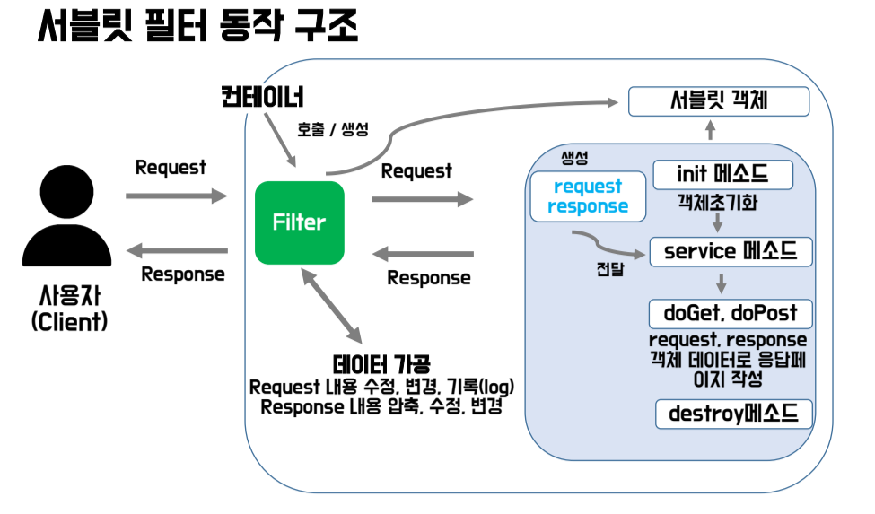
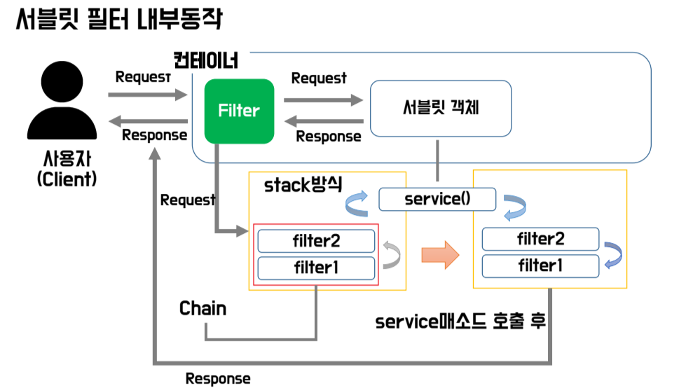

# 2024.06.10 - TIL
<br>

# 1. Servlet Filter

Sevlet Filter에 대해 알아보자!
<br>

## 1-1. Servlet Filter 란?

- `javax.servlet.Filter`, `jakarta.servlet.Filter` 인터페이스를 상속 받아 구현하는 클래스.<br>
- HTTP 요청과 응답 사이에서 전달되는 데이터를 가로채어 서비스에 맞게 변경하고 걸러내는 필터링 작업을 수행할 수 있는 클래스이다.<br>
-> Servlet과 비슷한 모습을 보인다. (init, destroy, doFilter)


- **처리 내용**
  1. Request : 보안 관련 사항, 요청헤더와 바디 형식 지정, 요청에 대한 log기록 유지
  2. Response : 응답 스트림압축, 응답스트림 내용 추가 및 수정, 새로운 응답 작성
<br>

## 1-2. Servlet Filter 동작 구조

<br>
[ 출저 : team.ohgiraffers ]

<br>


<br>
[ 출저 : team.ohgiraffers ]

<br>

## 1-3.Filter 클래스 구조
<br>

`jakarta.servlet.Filter` 인터페이스를 상속 받는다.

### 1. init (FilterConfig config);
- 웹 컨테이너가 필터를 호출할 경우 해당 메소드가 호출되어 필터 객체를 생성하며 초괴화한다.<br>
  
- 매개변수 FilterConfig는 web.xml에 있는 filter 정보를 가지고 있다.

### 2. doFilter (ServletRequest req, ServletResponse res, FilterChain chain)
- 필터가 수행될 때 구동하는 메소드로, 요청 객체와 응답 객체를 사용해 일련의 작업을 수행한 뒤, chain을 통해 가공된 값을 목적지로 전송한다.

### 3. destroy();
- 역할이 끝난 필터는 웹 컨테이너에 의해 해당 메소드를 호출하고 소멸된다.

### 4. FilterChain (interface)
- 필터는 chain처럼 서로 연결되어 있는데 연결 되어있는 필터를 순차별로 doFilter() 메소드를 이용하여 실행시키는 메소드<br>
  
- 마지막 필터가 실행된 후에는 service() 메소드를 실행시켜 서블릿의 메소드 (doGet, doPost)를 실행<br>
  
- doFilter 메소드 : chain으로 연결되어 있는 다음 필터를 실행하는 메소드

<br>

```java
import jakarta.servlet.*;
import jakarta.servlet.annotation.WebFilter;

import java.io.IOException;

// 필터 설정 : xml, annotation 방식 --> annotation 방식으로 설정하기

@WebFilter("/first/*")
// /first/* : first로 시작하는 모든 하위 주소를 다 체크하겠다.
public class FirstFilter implements Filter {

    public FirstFilter() {
      // 인스턴스 생성 시 작업할 내용
      // 필터는 톰캣을 start하는 시점부터 인스턴스를 미리 생성해둔다.
    }

    @Override
    public void init(FilterConfig filterConfig) throws ServletException {
      // Filter 호출 시 작업 설정        
    }

    
    @Override
    public void destroy() {
      // 삭제시 작업 설정
      // 필터 인스턴스는 톰캣 종료시 소멸된다.    
    }

    // 서비스 쪽으로 넘겨줘는 메소드
    @Override
    public void doFilter(ServletRequest request, ServletResponse response, FilterChain filterChain) throws IOException, ServletException {
      // 필터링 작업할 내용
      // Servlet으로 request가 전달되기 전에 요청을 가로채는 역할을 하는 메소드
    }
}
```
<br>

## 1-4. 
