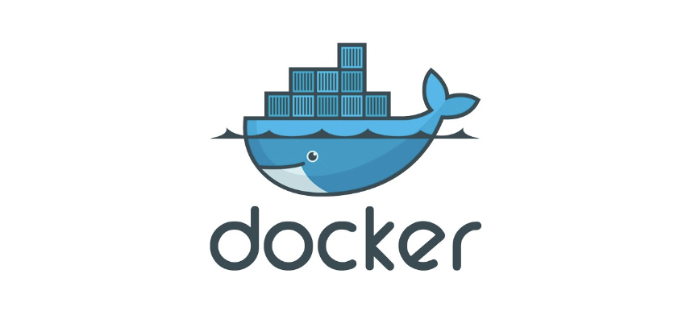
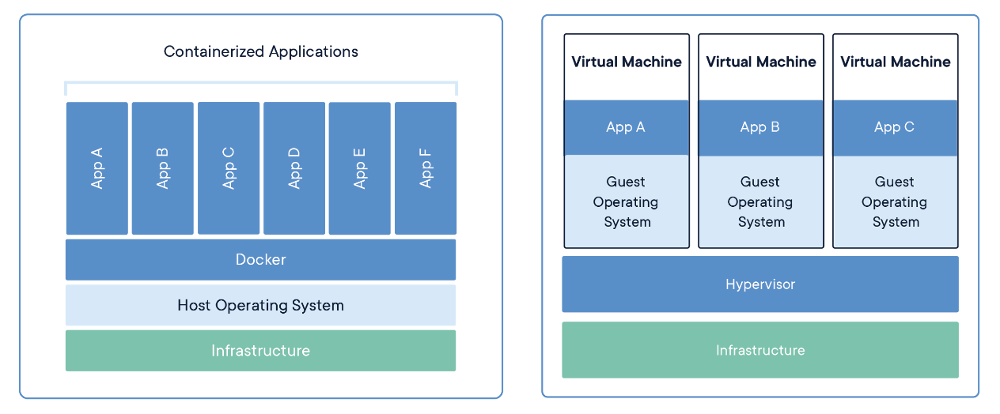
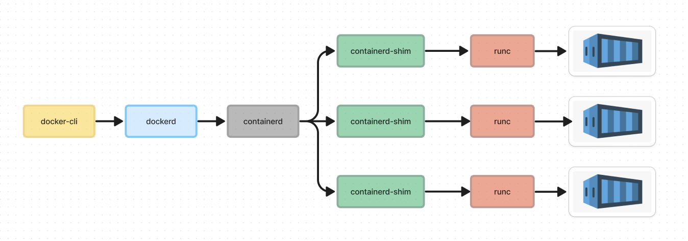

# 24.06.09  - TIL
 

# 1. Docker 기초 지식

 

## 1-1. Docker의 정의 
 

`컨테이너` 라고 부르는 운영체제 수준의 가상화 방식으로 소프트웨어를 배포하는 방식을 사용하는 `PaaS` 제품
- 다양한 개발 환경에서 컨테이너를 이용해서 소프트웨어를 편리하게 배포할 수 있게 해준다.

 

> PaaS (Platform as a Service) 
> - 클라우드 컴퓨팅 서비스의 한 종류 (IaaS, PaaS, SaaS..) 
> - 어플리케이션, 데이터 단계만 사용자가 관리하는 서비스 
> = 애플리케이션을 구축, 실행 및 관리하는 데 필요한 플랫폼을 제공하는 서비스 
>
> - 애플리케이션 코드를 작성하고 실행 환경, 데이터베이스, 웹 서버 등의 기술적인 측면을 고려하지 않고도 
> 애플리케이션을 배포할 수 있게 해준다. 
>
> 장점 
> 1. 인프라 및 관리 비용 절감 
> : 하드웨어 인프라 (서버, 스토리지, 네트워크) 등의 구매가 필요 없다. 
> 
> 2. 개발 생산성 증가  
> : 개발에 필요한 미들웨어, DB, 개발도구 등을 쉽게 구성할 수 있도록 지원해준다. 
> 
> 3. 어플리케이션 확장 용이 
> : 필요에 따라 인프라를 확장 시킬 수 있고 자동으로 자원을 할당하고 해제할 수 있음. 
> 
> 4. 어플리케이션 운영을 자동화 & 안정성과 보안성 보장 

 

[ 도커를 활용한 어플리케이션 실행 ]  

출처 : <a>https://www.docker.com/resources/what-container/</a>
 

운영체제 위에 도커가 설치되고 도커는 컨테이너 단위로 어플리케이션을 실행하게 된다. 
컨테이너들은 서로 격리되어 있어서 독립성이 보장된다. 
각 컨테이너는 어플리케이션이 실행되는데 필요한 최소한의 바이너리, 라이브러리를 포함한다. 

## 1-2. Image & Container의 개념
 

**Image란?**
- 서비스 운영에 필요한 서버 프로그램, 소스코드 및 라이브러리, 컴파일 된 실행 파일을 묶는 형태 
  
- 즉, 특정 프로세스를 실행하기 위한 모든 파일과 설정값을 지닌 파일들의 묶음으로 볼 수 있다.
  
 

**Container란?**

- 소프트웨어를 배포할 때 필요한 `코드, 라이브러리, 환경 설정 파일` 들을 한데 모아 격리시킨 후 실행 가능한 패키지로 만든 것 
  
- 이미지를 실행한 상태로, 응용 프로그램의 종속성과 함께 응용프로그램 자체를 패키징 or 캡슐화 하여 격리된 공간에서  프로세스를 동작시키는 기술

 

## 1-3. 가상화

**가상화란?**<
- 컴퓨터에서 활용하는 리소스를 추상화하는 개념을 의미하는 용어.
- 단일 컴퓨터 자원을 여러 개의 논리적인 자원으로 나누어 동작시킬 수 있음.

 

**가상화의 종류**
1. **호스트 가상화 (Host Virtualization)** 
   
   - 운영체제를 설치한 후 하이퍼바이저를 통해 가상 머신을 만들고 각 가상머신 내부에 게스트 운영체제를 설치  
  
   - `VirtualBox`, `VM웨어` 등이 있다.
  

1. **하이퍼바이저 가상화 (Hypervisor Virtualization)** 
   - 호스트 가상화와는 달리 호스트 운영체제를 필요로 하지 않는 방식에 해당 
  
   - 부팅 시 가상머신을 선택하게 된다. 성능이 우수하지만, 초기 설정이 복잡하고 관리가 어려움.
  

1. **컨테이너 가상화 (Container Virtualization)** 
   - 운영체제 위에 컨테이너를 운영하기 위해 필요한 도커를 설치한 후 다수의 컨테이너를 통해 어플리케이션을 실행하는 방식 
  
   - `도커(Docker)`, `쿠버네티스(Kubernetes)`가 해당 
  
   - 컨테이너 간 격리가 되기 때문에 다른 어플리케이션에 영향을 미치지 않아서 서로 다른 컴퓨팅 환경에서 실행하는데 용이
 

<pre>
[ Hypervisor란..? ]
> 단일 물리 머신에서 다수의 가상머신을 실행할 때 활용하는 소프트웨어
</pre>

 

## 1-4. Docker의 장점
 

1. VM을 사용하지 않고 도커 엔진을 이용하여 동작하기 때문에 성능 개선과 동시에 메모리 용량을 적
게 요구한다.

2. 컨테이너를 실행하기 위한 모든 정보를 가지고 있기 때문에, 새로운 환경에서 이것 저것 설치할 필
요 없이 새로운 서버에 이미지만 다운받아서 컨테이너를 생성할 수 있다.

3. 개발환경 설정할 때 초기 세팅이 빠르고 실행환경을 강제화할 수 있다.

4. 도커는 개발자가 원하는 환경 세팅을 모듈식 유닛을 조합함으로써 만들수 있게 해준다. 이는 개발 
주기, 기능 배포, 버그 수정의 속도를 높여준다.

## 1-5. 도커 구성 요소
 

 [컨테이너가 실행되기까지 필요한 도구 ]  

**1. 도커 클라이언트 (docker-cli)**
- 도커 클라이언트. 터미널이라고 생각하면 편하다.
- 명령어 행으로 dockerd API를 활용해 build, pull, run과 같은 명령을 내린다.
- 도커 데몬(Docker Demon)과 통신도 한다.

**2. 도커 데몬 (dockerd)**
- 백그라운드에서 실행되는 데몬 프로세스에 해당한다.
- 도커 API 요청을 수신하고 도커 이미지, 컨테이너 등과 같은 도커와 관련된 객체를 관리한다.

**3. containerd**
- 컨테이너 실행과 관리에 필요한 기능을 수행하는 오픈소스 컨테이너 런타임.
- 도커 이미지 전송, 컨테이너 실행, 스토리지, 네트워크 등의 컨테이너 생명주기를 모두 관리

**4. runc**
- 컨테이너 실행과 관련된 작업을 수행하는 저수준 컨테이너 런타임.
- 실제 컨테이너의 실행만 담당한다.

**5. containerd-shim**
- containerd와 runc 사이에서 작동하는 중간 프로세스
- 컨테이너 실행을 조정하는 역할